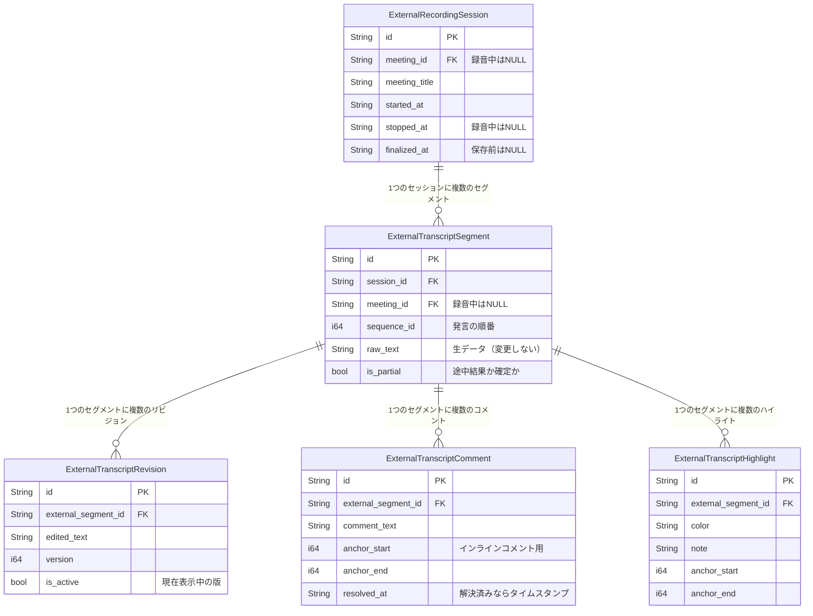

# External Web UI Step 2 — データモデルとリポジトリ層の追加

> **対応PR**: [#8 feat(db): add external web UI models and repository layer (Step 2)](https://github.com/kobayashi-shuto-0105/meetily-live-viewer/pull/8)
> **対応プラン**: `docs/external-web-ui-plan.md` の Step 2

---

## 1. 概要

PR #8 は **External Web UI（外部ブラウザから文字起こしを閲覧・編集する機能）** の **Step 2** にあたる実装です。

Meetily 本体が保存する文字起こしデータ（`transcripts` テーブル）には一切手を加えず、**別テーブル（`external_*`）を overlay（上乗せ）として使う**設計の中で、Rust 側の「データの形」と「データの操作方法」を追加しました。

### 変更ファイル一覧（3ファイル、+673行）

| ファイル | 変更内容 | 追加行数 |
|---|---|---|
| `frontend/src-tauri/src/database/models.rs` | External Web UI 用の Rust モデル（struct）を追加 | +127行 |
| `frontend/src-tauri/src/database/repositories/external_web.rs` | DB操作をまとめた `ExternalWebRepository` を新規追加 | +545行 |
| `frontend/src-tauri/src/database/repositories/mod.rs` | `external_web` モジュールを登録 | +1行 |

---

## 2. データモデルとは何か

### データベースのテーブルを Rust の struct で表現したもの

データベースには「テーブル」があります。Excel のシートのようなイメージです。

```
external_recording_sessions テーブル（DB側）
┌────────────────────┬────────────┬───────────────┬────────────────────┐
│ id                 │ meeting_id │ meeting_title │ started_at         │
├────────────────────┼────────────┼───────────────┼────────────────────┤
│ ext-session-abc123 │ NULL       │ 朝会          │ 2026-05-08T09:00Z  │
└────────────────────┴────────────┴───────────────┴────────────────────┘
```

このテーブルの **1行** をそのまま Rust のコードで表現したものが **モデル（struct）** です。

```rust
pub struct ExternalRecordingSession {
    pub id: String,                    // テーブルの id カラム
    pub meeting_id: Option<String>,    // NULL になり得るカラムは Option<>
    pub meeting_title: Option<String>,
    pub started_at: String,
    // ...
}
```

### `Option<T>` は NULL を意味する

Rust では「値がないかもしれない」ことを `Option<T>` で表現します。

| Rust の型 | 意味 |
|---|---|
| `String` | **必ず値がある**文字列 |
| `Option<String>` | **値があるかもしれないし、NULL かもしれない**文字列 |

例えば `meeting_id: Option<String>` は、録音中はまだ meeting_id が存在しない（`None` = NULL）ので `Option` になっています。

### `#[derive(...)]` アノテーションの意味

```rust
#[derive(Debug, Clone, FromRow, Serialize, Deserialize)]
pub struct ExternalRecordingSession { ... }
```

| アノテーション | 意味 |
|---|---|
| `Debug` | デバッグ表示（`println!("{:?}", session)` ）ができる |
| `Clone` | オブジェクトの複製ができる |
| `FromRow` | **DBから取得した1行を自動でこの struct に変換**できる（sqlx の機能） |
| `Serialize` | Rust の struct → **JSON に変換**できる（serde の機能） |
| `Deserialize` | JSON → **Rust の struct に復元**できる（serde の機能） |

これらは Rust の「おまじない」のようなもので、手動で変換コードを書かなくても自動で対応してくれます。

---

## 3. 追加された5つのモデルの解説（`models.rs`）

### ① ExternalRecordingSession — 録音セッション

**対応テーブル**: `external_recording_sessions`

**役割**: 録音セッションを管理する。録音中は `meeting_id = NULL` のまま、保存完了後に `meeting_id` が紐づく。

| フィールド | 型 | 説明 |
|---|---|---|
| `id` | `String` | セッションの一意ID（例: `ext-session-<uuid>`） |
| `meeting_id` | `Option<String>` | 紐づく meetings.id。録音中は None、保存完了後にセット |
| `meeting_title` | `Option<String>` | ユーザーに表示するタイトル（録音中は仮タイトル） |
| `started_at` | `String` | 録音開始時刻（ISO8601） |
| `stopped_at` | `Option<String>` | 録音停止時刻。録音中は None |
| `finalized_at` | `Option<String>` | api_save_transcript で確定した時刻 |
| `created_at` | `String` | レコード作成時刻 |
| `updated_at` | `String` | レコード更新時刻 |

```rust
#[derive(Debug, Clone, FromRow, Serialize, Deserialize)]
pub struct ExternalRecordingSession {
    pub id: String,
    pub meeting_id: Option<String>,
    pub meeting_title: Option<String>,
    pub started_at: String,
    pub stopped_at: Option<String>,
    pub finalized_at: Option<String>,
    pub created_at: String,
    pub updated_at: String,
}
```

---

### ② ExternalTranscriptSegment — 文字起こしの1セグメント（発言）

**対応テーブル**: `external_transcript_segments`

**役割**: Whisper のリアルタイム認識結果（`TranscriptUpdate`）を1セグメントとして保持する。`is_partial = true` が途中結果、`false` が確定結果。

| フィールド | 型 | 説明 |
|---|---|---|
| `id` | `String` | セグメントの一意ID |
| `session_id` | `String` | 所属する録音セッションID |
| `meeting_id` | `Option<String>` | 保存後に確定する meetings.id |
| `source_transcript_id` | `Option<String>` | 生データとの対応関係用 transcripts.id |
| `sequence_id` | `i64` | 発言の順番番号（1, 2, 3...）。upsert用の一意キー |
| `raw_text` | `String` | 文字起こしテキスト本体（**生データ。変更しない**） |
| `timestamp` | `String` | 表示用タイムスタンプ（例: `14:30:05`） |
| `source` | `Option<String>` | 音源種別（"microphone" / "system" 等） |
| `is_partial` | `bool` | true = 途中結果、false = 確定 |
| `confidence` | `Option<f64>` | Whisper の認識精度（0.0〜1.0） |
| `audio_start_time` | `Option<f64>` | 録音開始からの相対秒数（開始） |
| `audio_end_time` | `Option<f64>` | 録音開始からの相対秒数（終了） |
| `duration` | `Option<f64>` | 発言の長さ（秒） |
| `created_at` | `String` | レコード作成時刻 |
| `updated_at` | `String` | レコード更新時刻 |

```rust
#[derive(Debug, Clone, FromRow, Serialize, Deserialize)]
pub struct ExternalTranscriptSegment {
    pub id: String,
    pub session_id: String,
    pub meeting_id: Option<String>,
    pub source_transcript_id: Option<String>,
    pub sequence_id: i64,
    pub raw_text: String,
    pub timestamp: String,
    pub source: Option<String>,
    pub is_partial: bool,
    pub confidence: Option<f64>,
    pub audio_start_time: Option<f64>,
    pub audio_end_time: Option<f64>,
    pub duration: Option<f64>,
    pub created_at: String,
    pub updated_at: String,
}
```

---

### ③ ExternalTranscriptRevision — 編集後テキストのバージョン履歴

**対応テーブル**: `external_transcript_revisions`

**役割**: ユーザーが編集したテキストのバージョン履歴を管理する。**生データ（`raw_text`）は一切変更しない**設計思想のため、編集後テキストはすべてここに積まれていく。`is_active = true` が現在表示中の版。

```
raw_text（生データ）: "えーっと、今日の議題は三つあります"  ← 変更しない！

revision v1: "えーっと、今日の議題は3つあります"  is_active=false
revision v2: "今日の議題は3つあります"             is_active=true  ← 現在表示中
```

| フィールド | 型 | 説明 |
|---|---|---|
| `id` | `String` | リビジョンの一意ID |
| `external_segment_id` | `String` | 対象セグメントのID |
| `edited_text` | `String` | 編集後テキスト本体 |
| `editor_name` | `Option<String>` | 編集者名（匿名運用もあり得るため Option） |
| `version` | `i64` | バージョン番号（1, 2, 3...） |
| `is_active` | `bool` | 現在表示すべき版かどうか（同一セグメント内で1つだけ true） |
| `created_at` | `String` | レコード作成時刻 |
| `updated_at` | `String` | レコード更新時刻 |

```rust
#[derive(Debug, Clone, FromRow, Serialize, Deserialize)]
pub struct ExternalTranscriptRevision {
    pub id: String,
    pub external_segment_id: String,
    pub edited_text: String,
    pub editor_name: Option<String>,
    pub version: i64,
    pub is_active: bool,
    pub created_at: String,
    pub updated_at: String,
}
```

---

### ④ ExternalTranscriptComment — コメント

**対応テーブル**: `external_transcript_comments`

**役割**: セグメントへのコメント。`anchor_start`/`anchor_end` が NULL ならセグメント全体へのコメント、数値を指定するとインラインコメント（GitHub のコードレビューのように、テキストの特定範囲にコメントを付ける）になる。

| フィールド | 型 | 説明 |
|---|---|---|
| `id` | `String` | コメントの一意ID |
| `external_segment_id` | `String` | 対象セグメントのID |
| `comment_text` | `String` | コメント本文 |
| `author_name` | `Option<String>` | 投稿者名 |
| `anchor_start` | `Option<i64>` | テキスト内の文字インデックス開始位置 |
| `anchor_end` | `Option<i64>` | テキスト内の文字インデックス終了位置 |
| `anchor_revision_id` | `Option<String>` | anchor の基準となった revision（raw_text 基準なら None） |
| `resolved_at` | `Option<String>` | 解決済み時刻（None なら未解決） |
| `created_at` | `String` | レコード作成時刻 |
| `updated_at` | `String` | レコード更新時刻 |

```rust
#[derive(Debug, Clone, FromRow, Serialize, Deserialize)]
pub struct ExternalTranscriptComment {
    pub id: String,
    pub external_segment_id: String,
    pub comment_text: String,
    pub author_name: Option<String>,
    pub anchor_start: Option<i64>,
    pub anchor_end: Option<i64>,
    pub anchor_revision_id: Option<String>,
    pub resolved_at: Option<String>,
    pub created_at: String,
    pub updated_at: String,
}
```

---

### ⑤ ExternalTranscriptHighlight — ハイライト（マーカー）

**対応テーブル**: `external_transcript_highlights`

**役割**: テキスト範囲のハイライト（マーカー）。色やメモを付けることができる。

| フィールド | 型 | 説明 |
|---|---|---|
| `id` | `String` | ハイライトの一意ID |
| `external_segment_id` | `String` | 対象セグメントのID |
| `color` | `String` | ハイライト色（UI パレットキー or hex 文字列） |
| `note` | `Option<String>` | 任意のメモ |
| `anchor_start` | `Option<i64>` | テキスト内の文字インデックス開始位置 |
| `anchor_end` | `Option<i64>` | テキスト内の文字インデックス終了位置 |
| `anchor_revision_id` | `Option<String>` | anchor の基準となった revision |
| `created_at` | `String` | レコード作成時刻 |
| `updated_at` | `String` | レコード更新時刻 |

```rust
#[derive(Debug, Clone, FromRow, Serialize, Deserialize)]
pub struct ExternalTranscriptHighlight {
    pub id: String,
    pub external_segment_id: String,
    pub color: String,
    pub note: Option<String>,
    pub anchor_start: Option<i64>,
    pub anchor_end: Option<i64>,
    pub anchor_revision_id: Option<String>,
    pub created_at: String,
    pub updated_at: String,
}
```

---

## 4. モデル間のリレーション図

### テキストアート版

```
ExternalRecordingSession（録音セッション）
  │
  │  1 : N
  │
  └── ExternalTranscriptSegment（文字起こし1発言）
        │
        │  1 : N
        │
        ├── ExternalTranscriptRevision（編集後テキストの履歴）
        ├── ExternalTranscriptComment（コメント）
        └── ExternalTranscriptHighlight（ハイライト）
```

### Mermaid 版



---

## 5. リポジトリ（`external_web.rs`）とは何か

### モデルが「データの形」なら、リポジトリは「データの操作方法」

```
モデル    = Excel のシートの「列の定義」
リポジトリ = Excel のマクロVBA（「行を追加する」「行を検索する」等の操作）
```

モデルは「このデータはこういう構造だよ」という定義だけ。実際にデータベースに読み書きする関数をまとめたのが **リポジトリ** です。

### `pub struct ExternalWebRepository;` がなぜ空の struct なのか

```rust
pub struct ExternalWebRepository;  // 中身が空！
```

これは「関数をまとめるための入れ物」です。Rust ではインスタンス（オブジェクト）を作らず、**static メソッド**（`ExternalWebRepository::create_session(...)` のように呼ぶ）として使います。既存の `TranscriptsRepository` や `SettingsRepository` と同じパターンです。

### `pool: &SqlitePool` は DB 接続を意味する

全メソッドの第一引数が `pool: &SqlitePool` になっています。これは **データベースへの接続プール**（複数の接続をまとめて管理するもの）で、「このDB接続を使って操作してね」という意味です。

---

## 6. 全メソッドの解説

### セッション操作

#### `create_session(pool, meeting_title)` — 録音開始時

- UUID で `ext-session-<uuid>` という ID を生成
- DB に INSERT（`meeting_id = NULL` で開始）
- 作成した `ExternalRecordingSession` struct を返す

```rust
pub async fn create_session(
    pool: &SqlitePool,
    meeting_title: Option<&str>,
) -> Result<ExternalRecordingSession, SqlxError> {
    let id = format!("ext-session-{}", Uuid::new_v4());
    let now = chrono::Utc::now().to_rfc3339();

    sqlx::query(
        "INSERT INTO external_recording_sessions
         (id, meeting_id, meeting_title, started_at, created_at, updated_at)
         VALUES (?, NULL, ?, ?, ?, ?)",
    )
    .bind(&id)
    .bind(meeting_title)
    .bind(&now)
    .bind(&now)
    .bind(&now)
    .execute(pool)
    .await?;

    Ok(ExternalRecordingSession {
        id,
        meeting_id: None,
        meeting_title: meeting_title.map(|s| s.to_string()),
        started_at: now.clone(),
        stopped_at: None,
        finalized_at: None,
        created_at: now.clone(),
        updated_at: now,
    })
}
```

#### `stop_session(pool, session_id)` — 録音停止時

- `stopped_at` を現在時刻に UPDATE

#### `finalize_session(pool, session_id, meeting_id)` — 保存完了後

- **トランザクション**でセッションと全セグメントに `meeting_id` を一括更新
- セッション自身に `meeting_id` と `finalized_at` をセット
- 同セッションに属する全セグメントにも `meeting_id` を伝播

#### `get_session_by_id(pool, session_id)` — ID 指定で取得

- 指定 ID のセッションを1件取得（存在しなければ `None`）

#### `get_active_session(pool)` — アクティブなセッションを取得

- `stopped_at IS NULL`（= 録音中）の最新セッションを1件取得

---

### セグメント操作

#### `upsert_segment(...)` — セグメントの upsert（挿入 or 上書き）

- `ON CONFLICT(session_id, sequence_id) DO UPDATE` で partial → final の上書き
- 詳細は後述「[7. 特に重要な実装パターン](#7-特に重要な実装パターンの詳細説明)」を参照

#### `get_segments_by_session(pool, session_id)` — セッション内の全セグメント

- `sequence_id` 昇順で取得

#### `get_segments_by_meeting(pool, meeting_id)` — ミーティング内の全セグメント

- `finalize_session()` 完了後に使用。`sequence_id` 昇順で取得

---

### リビジョン操作

#### `create_revision(pool, segment_id, edited_text, editor_name)` — 新しい版を作成

- **トランザクション**で原子的に実行
- 詳細は後述「[7. 特に重要な実装パターン](#7-特に重要な実装パターンの詳細説明)」を参照

#### `get_active_revision(pool, segment_id)` — 現在アクティブな版を取得

- `is_active = 1` の版を取得。存在しなければ `None`（= `raw_text` をそのまま表示）

#### `get_revisions_by_segment(pool, segment_id)` — 全バージョン履歴

- `version` 降順（最新が先頭）で全履歴を取得

---

### コメント操作

#### `create_comment(...)` — コメント作成

- `anchor_start` / `anchor_end` を指定するとインラインコメントになる
- UUID で ID を生成し、DB に INSERT

#### `resolve_comment(pool, comment_id)` — コメントを解決済みに

- `resolved_at` に現在時刻をセット

#### `get_comments_by_segment(pool, segment_id)` — コメント一覧

- `created_at` 昇順で取得

---

### ハイライト操作

#### `create_highlight(...)` — ハイライト作成

- 色やメモ、文字範囲を指定して作成

#### `delete_highlight(pool, highlight_id)` — ハイライト削除

- 指定 ID のハイライトを DELETE

#### `get_highlights_by_segment(pool, segment_id)` — ハイライト一覧

- `created_at` 昇順で取得

---

## 7. 特に重要な実装パターンの詳細説明

### upsert（ON CONFLICT DO UPDATE）

Whisper は発言を認識する過程で、**同じ発言の途中結果を何度も送ってきます**。

```
sequence_id=5, is_partial=true,  text="えーっと今日"     → INSERT（新規保存）
sequence_id=5, is_partial=true,  text="えーっと今日は"   → UPDATE（上書き）
sequence_id=5, is_partial=false, text="えーっと今日はね" → UPDATE（確定！）
```

毎回新しい行を作らず、**同じ行を上書き**していくために `ON CONFLICT ... DO UPDATE` を使っています。

```rust
sqlx::query(
    "INSERT INTO external_transcript_segments
        (id, session_id, sequence_id, raw_text, is_partial, ...)
     VALUES (?, ?, ?, ?, ?, ...)
     ON CONFLICT(session_id, sequence_id) DO UPDATE SET
        raw_text = excluded.raw_text,
        is_partial = excluded.is_partial,
        confidence = excluded.confidence,
        audio_start_time = excluded.audio_start_time,
        audio_end_time = excluded.audio_end_time,
        duration = excluded.duration,
        updated_at = excluded.updated_at",
)
```

**ポイント**:
- `ON CONFLICT(session_id, sequence_id)` → 同じセッション内で同じ sequence_id の行がすでにあったら
- `DO UPDATE SET ...` → INSERT ではなく UPDATE する
- `excluded.raw_text` → INSERT しようとした新しい値を使う

---

### トランザクション（create_revision）

`create_revision` ではトランザクションを使って **3つの操作を原子的に（全部まとめて）実行** しています。

**なぜトランザクションが必要か？**

Step 1〜3 の間にエラーが起きると「古い版が非アクティブ、新しい版も存在しない」という**壊れた状態**になってしまいます。トランザクションがあれば、エラー時は全部元に戻ります。

```rust
pub async fn create_revision(...) {
    let mut tx = pool.begin().await?;  // トランザクション開始

    // Step 1: 今のアクティブ版を「非アクティブ」にする
    sqlx::query(
        "UPDATE external_transcript_revisions
         SET is_active = 0
         WHERE external_segment_id = ? AND is_active = 1"
    ).execute(&mut *tx).await?;

    // Step 2: バージョン番号を計算（現在の最大 + 1）
    let max_version: Option<i64> = sqlx::query_scalar(
        "SELECT MAX(version) FROM external_transcript_revisions
         WHERE external_segment_id = ?"
    ).fetch_one(&mut *tx).await?;
    let next_version = max_version.unwrap_or(0) + 1;

    // Step 3: 新しい版を is_active=1 で INSERT
    sqlx::query(
        "INSERT INTO external_transcript_revisions
            (..., is_active) VALUES (..., 1)"
    ).execute(&mut *tx).await?;

    tx.commit().await?;  // ← ここまで全部成功したら確定！
                         //    途中でエラーなら全部なかったことに
}
```

**Step 1〜3 の流れまとめ**:

| Step | 操作 | 目的 |
|---|---|---|
| 1 | 既存の active 版を `is_active = 0` に | 同時に2つの版が active にならないようにする |
| 2 | `MAX(version)` を取得して +1 | 次のバージョン番号を算出 |
| 3 | 新しい版を `is_active = 1` で INSERT | 最新の編集内容を active として保存 |

---

## 8. `mod.rs` の変更

```rust
// frontend/src-tauri/src/database/repositories/mod.rs
pub mod external_web;  // ← 追加された1行
pub mod meeting;
pub mod setting;
pub mod summary;
pub mod transcript;
pub mod transcript_chunk;
```

### Rust ではファイルを作っただけでは使えない

`external_web.rs` というファイルを作っただけでは、Rust コンパイラはその存在を知りません。`mod.rs` に `pub mod external_web;` と書くことで、「このディレクトリに `external_web.rs` があるよ、他のファイルからも使えるよ」と Rust コンパイラに教えます。

JavaScript で言うと `export` に近いイメージです。

```javascript
// JavaScript のイメージ
export { ExternalWebRepository } from './external_web';
```

---

## 9. 録音〜保存の全体フロー

```
┌─────────────────────────────────────────────────────────────┐
│                     メインフロー                              │
├─────────────────────────────────────────────────────────────┤
│                                                             │
│  録音開始                                                    │
│    └→ create_session("朝会")                                │
│       → external_recording_sessions に1行 INSERT             │
│         (meeting_id = NULL)                                  │
│                                                             │
│  ↓                                                          │
│                                                             │
│  （録音中）Whisper が発言を認識するたびに                       │
│    └→ upsert_segment(session_id, sequence_id, text, ...)    │
│       → partial(途中結果)→ final(確定) を上書き               │
│                                                             │
│  ↓                                                          │
│                                                             │
│  録音停止                                                    │
│    └→ stop_session(session_id)                              │
│       → stopped_at を現在時刻に UPDATE                       │
│                                                             │
│  ↓                                                          │
│                                                             │
│  Meetily に保存完了（api_save_transcript）                     │
│    └→ finalize_session(session_id, meeting_id)              │
│       → session と全 segment に meeting_id を紐づけ           │
│                                                             │
├─────────────────────────────────────────────────────────────┤
│              ↑ 録音中〜保存後いつでも ↓                        │
├─────────────────────────────────────────────────────────────┤
│                                                             │
│  テキスト編集 → create_revision(segment_id, text, editor)    │
│                 → 履歴として積む（raw_text は変更しない）       │
│                                                             │
│  コメント追加 → create_comment(segment_id, text, ...)        │
│                                                             │
│  ハイライト   → create_highlight(segment_id, color, ...)     │
│                                                             │
└─────────────────────────────────────────────────────────────┘
```

---

## 10. このPRの対応範囲と後続PR

| Step | 内容 | 状態 |
|---|---|---|
| **Step 1** | DB マイグレーション（`external_*` テーブル追加） | ✅ 完了（PR #6） |
| **Step 2** | モデルとリポジトリ層の追加 | ✅ **このPR（#8）** |
| Step 3 | `external_web` モジュール（axum + WebSocket サーバー） | 🔜 未実装 |
| Step 4 | `recording_commands.rs` への接続（`transcript-update` を overlay にも流す） | 🔜 未実装 |
| Step 5 | `api_save_transcript` 完了後の `finalize_external_session` | 🔜 未実装 |
| Step 6 | `ext-frontend/` の作成（React UI） | 🔜 未実装 |

---

## 11. 設計思想まとめ

### 1. 生データは一切変更しない

Meetily 本体の `transcripts` テーブルに入っている文字起こしデータ（生データ）は**絶対に変更しません**。編集・コメント・ハイライトはすべて `external_*` テーブルに **overlay（上乗せ）** として別管理します。

### 2. overlay として `external_*` テーブルに別管理

```
┌───────────────────────────────────────────┐
│  既存テーブル（触らない）                     │
│  ┌─────────────────────────────────┐       │
│  │ transcripts（生の文字起こし）      │       │
│  │ meetings（ミーティング情報）       │       │
│  └─────────────────────────────────┘       │
├───────────────────────────────────────────┤
│  external_* テーブル（overlay）             │
│  ┌─────────────────────────────────┐       │
│  │ external_recording_sessions     │       │
│  │ external_transcript_segments    │       │
│  │ external_transcript_revisions   │       │
│  │ external_transcript_comments    │       │
│  │ external_transcript_highlights  │       │
│  └─────────────────────────────────┘       │
└───────────────────────────────────────────┘
```

### 3. 既存リポジトリと同じパターンで実装

`ExternalWebRepository` は既存の `TranscriptsRepository`、`SettingsRepository` と同じパターン（空の struct + static メソッド）で実装されており、コードベース全体で統一感があります。

### 4. 各関数・モデルに日本語コメントを付与

Rust のコード内にはすべて日本語のドキュメントコメント（`///`）が付与されており、コードを読むだけで何をしているか分かるようになっています。
